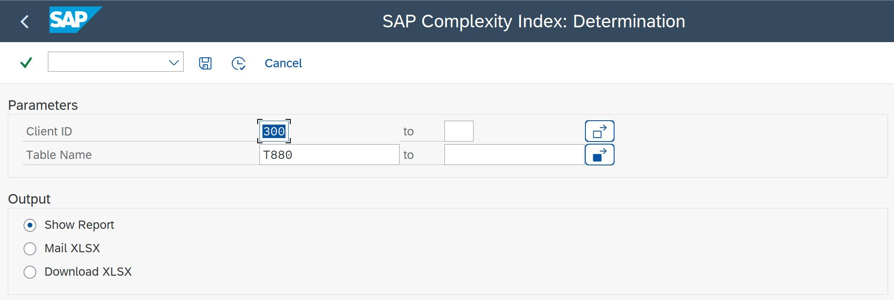
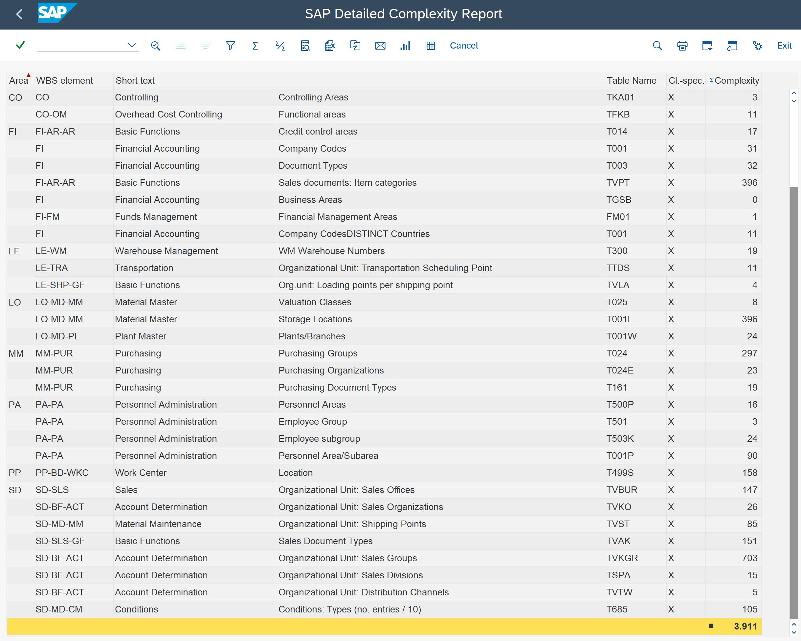

# ZBC_SAP_COMPLEXITY_INDEX

## SAP Complexity Index Calculation

The purpose of the report is to calculate a comparable metric
of system complexity. It uses a defined set of tables from all
areas (modules) of a SAP system.

By evaluating the system in regular intervals it is possible
to identify areas with high growth in complexity or to identify
areas with potential for improvements.

The result can be:
  - viewed via SALV
  - exported as an Excel XLSX
  - mailed as Excel XLSX file attachment (e.g. in a monthly job run)

The report is inspired by the paper
"Measuring Complexity of SAP Systems" by Ilja Holub and Tomas Bruckner

### Selection Screen

### Export Options
#### Show report

#### Mail Excel XLSX

#### Download Excel XLSX

